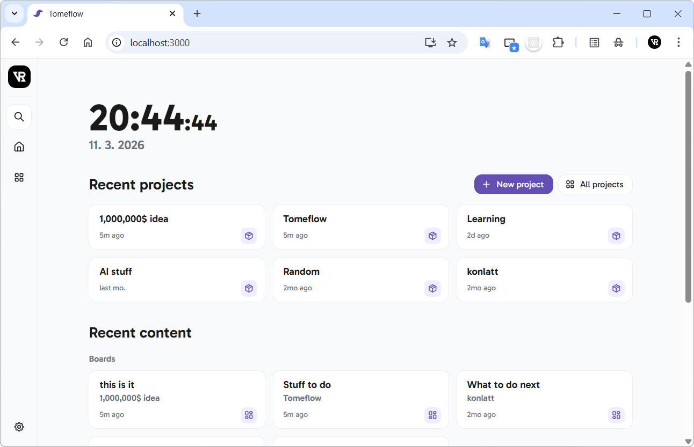
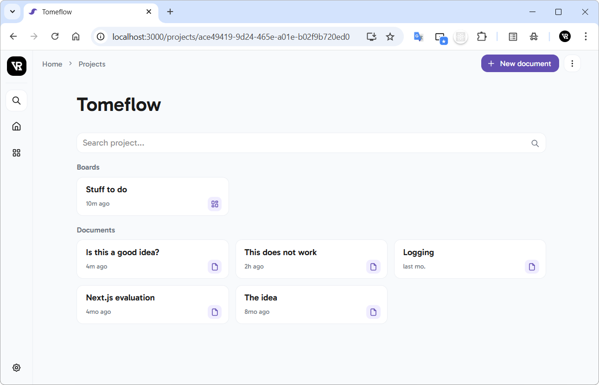
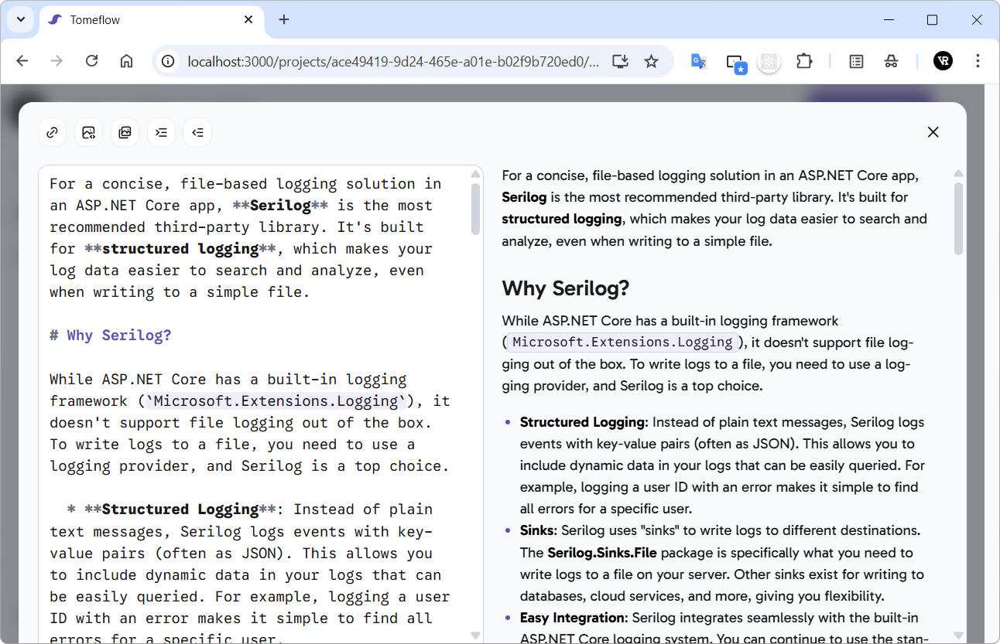
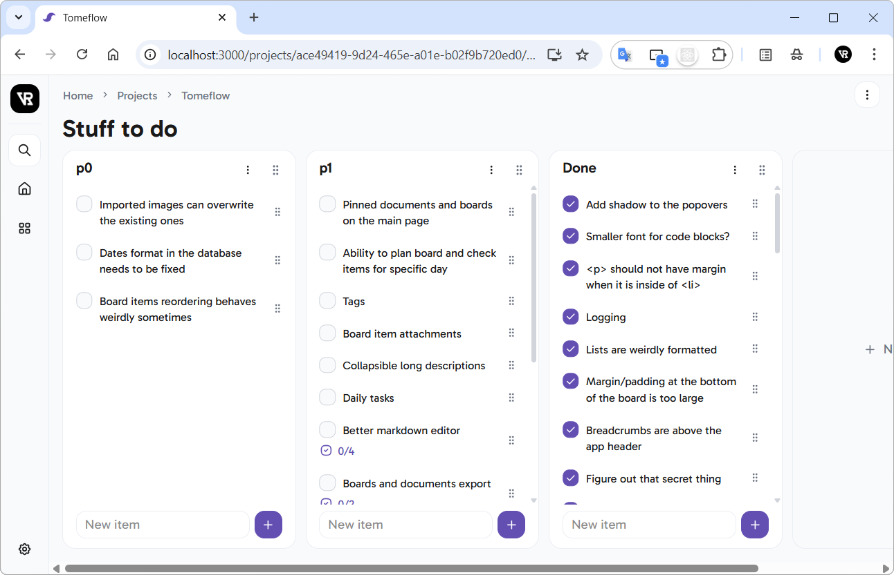

# Tomeflow

An all-in-one app for note-taking, project management, and task organization, designed to help users streamline their workflow and boost productivity.

## Key Features

Centralize your workflow. Manage multiple projects from a single, intuitive dashboard designed for clarity and speed:

<p align="center">
<picture>
    <source srcset="./art/screenshots/home_dark.png" media="(prefers-color-scheme: dark)">
    
</picture>
</p>

### Project Organization

Keep your plans and ideas siloed into distinct projects. Perfect for separating work, side hustles, and personal goals:

<p align="center">
<picture>
    <source srcset="./art/screenshots/project_dark.png" media="(prefers-color-scheme: dark)">
    
</picture>
</p>

### Markdown-First Documents

Write, brainstorm, and document with ease. A powerful Markdown editor allows you to create rich content within every project:

<p align="center">
<picture>
    <source srcset="./art/screenshots/markdown_editor_dark.png" media="(prefers-color-scheme: dark)">
    
</picture>
</p>

### Kanban-style Boards

Visualize your progress. Create an unlimited number of Kanban-style boards per project to track tasks from *TODO* to *Done*:

<p align="center">
<picture>
    <source srcset="./art/screenshots/board_dark.png" media="(prefers-color-scheme: dark)">
    
</picture>
</p>

## Tech Stack

Tomeflow leverages a modern web stack to ensure high performance and a seamless user experience without the need for local installations:

- [Next.js](https://nextjs.org/), [React](https://react.dev/), TypeScript
- [Turso](https://turso.tech/), [Drizzle ORM](https://orm.drizzle.team/)
- [NextAuth.js](https://next-auth.js.org/), [next-safe-action](https://next-safe-action.dev/), [TanStack Query](https://tanstack.com/query/latest), [Zod](https://zod.dev/)
- [dnd kit](https://dndkit.com/overview), [react-markdown](https://github.com/remarkjs/react-markdown)
- [Tailwind CSS](https://tailwindcss.com/), [React Icons](https://react-icons.github.io/react-icons/)


## How to Build and Run

Tomeflow is a Next.js app optimized for **Vercel**, using Turso for the database and Google OAuth for authentication.

### 1. Database Setup (Turso)

Turso is a managed SQLite database. You'll need the [Turso CLI](https://docs.turso.tech/local-development) installed.

1. **Create your database:**
    ```bash
    turso db create tomeflow-db
    ```

2. **Get connection details:**
    * **URL:** `turso db show --url tomeflow-db` (Use this for `TURSO_DATABASE_URL` and `AUTH_DRIZZLE_URL`)
    * **Token:** `turso db tokens create tomeflow-db` (Use this for `TURSO_AUTH_TOKEN`)

### 2. Authentication Setup (Google Cloud)

1. Go to the [Google Cloud Console](https://console.cloud.google.com/) and create a new project
2. Go to **Credentials > Create Credentials > OAuth client ID**
3. Select **Web application** and add the following **Authorized redirect URIs**:
    * Development: `http://localhost:3000/api/auth/callback/google`
    * Production: `https://your-app-domain.com/api/auth/callback/google`
4. Copy the **Client ID** and **Client Secret**

### 3. Environment Variables

Create a `.env.local` file and fill in the following:

```bash
# NextAuth Configuration
AUTH_SECRET="your_openssl_rand_base64_32_secret" # Generate with `openssl rand -base64 32`

# Turso Database
TURSO_DATABASE_URL="libsql://your-db-url.turso.io"
TURSO_AUTH_TOKEN="your_token_here"
AUTH_DRIZZLE_URL="libsql://your-db-url.turso.io" # Usually the same as TURSO_DATABASE_URL

# Google OAuth
AUTH_GOOGLE_ID="your_google_client_id"
AUTH_GOOGLE_SECRET="your_google_client_secret"

# Access Control
ALLOWED_GOOGLE_IDS="123456789,987654321" # Comma-separated Google Account IDs
```

### 4. Initialization

Once the environment variables are set, prepare the database and start the app:

```bash
npm install
npx drizzle-kit push   # Push schema to Turso
npm run dev            # Start local server
```